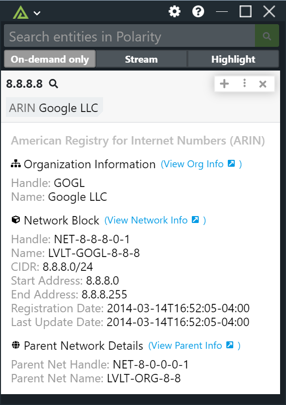

# Polarity ARIN Integration

The Polarity ARIN integration allows Polarity to search the American Registry of Internet Numbers database to return information about IP addresses.

## ARIN Integration Options

### Lookup IPv6 Addresses

ARIN has the ability to provide details on IPv6 addresses in addition to IPv4, checking this option will look up IPv6 addresses in addition to the default option that lookups IPv4 addresses.

### Blocklist IPs

This is an alternate option that can be used to specify a comma-delimited list of domains that you do not want sent to ARIN.  You can block partial matches on the domain name by providing just the text you want to match on.  For example, if you want to blocklist a whole top level domain such as ".com" you can do so by adding the entry `.com`.  If left blank, no IPs will be blocklisted.

### IP Blocklist Regex

This option allows you to specify a regex to blocklist IPv4 Addresses.  Any IPv4 matching the regex will not be looked up.  If the regex is left blank then no IPv4s will be blocklisted.

### Display Regional Registry Ownership Information

If checked, the integration will return a result when the IP address is controlled by one of the non-ARIN regional Internet registries (i.e., RIPE, APNIC, AFRINIC, LACNIC) as well as IANA.  If unchecked, only IP addresses controlled by ARIN will be returned.

### Max Concurrent Requests

Maximum number of concurrent requests. Integration must be restarted after changing this option. Defaults to 3.

### Minimum Time Between Lookups

Minimum amount of time in milliseconds between lookups (defaults to 250). Integration must be restarted after changing this option. Defaults to 250.

## Installation Instructions

Installation instructions for integrations are provided on the [PolarityIO GitHub Page](https://polarityio.github.io/).

## Polarity

Polarity is a memory-augmentation platform that improves and accelerates analyst decision making.  For more information about the Polarity platform please see:

https://polarity.io/
